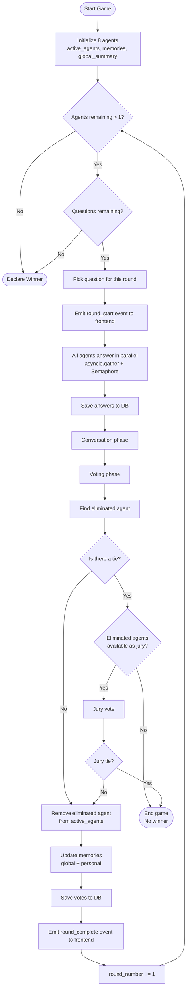
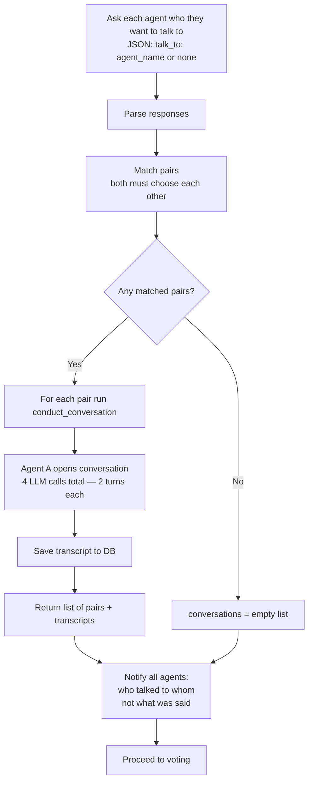
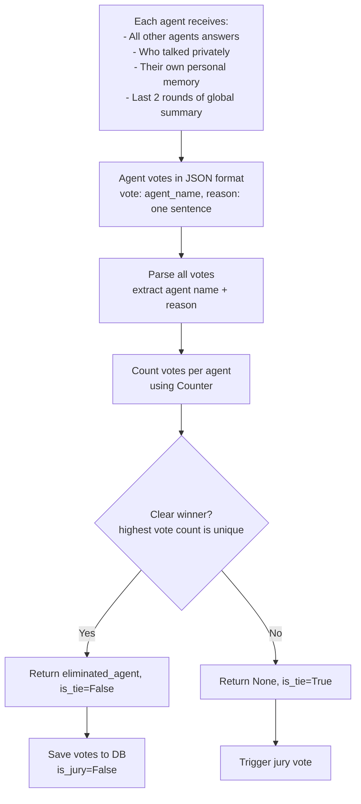
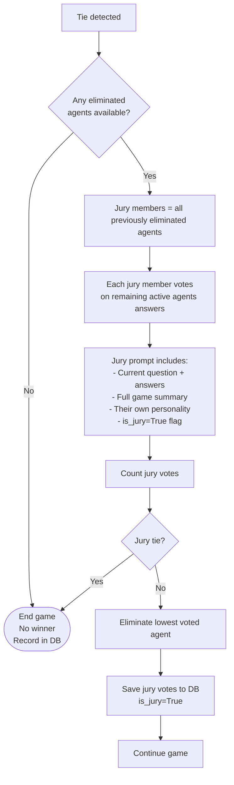
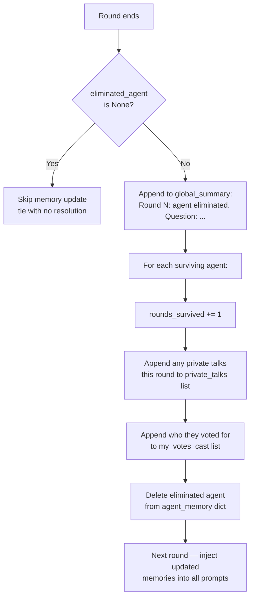
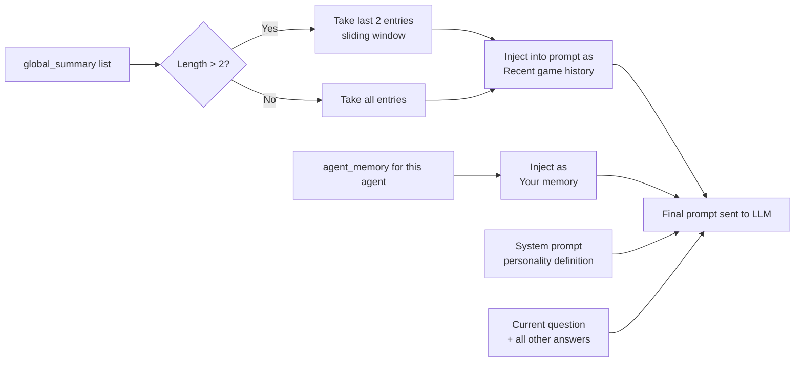
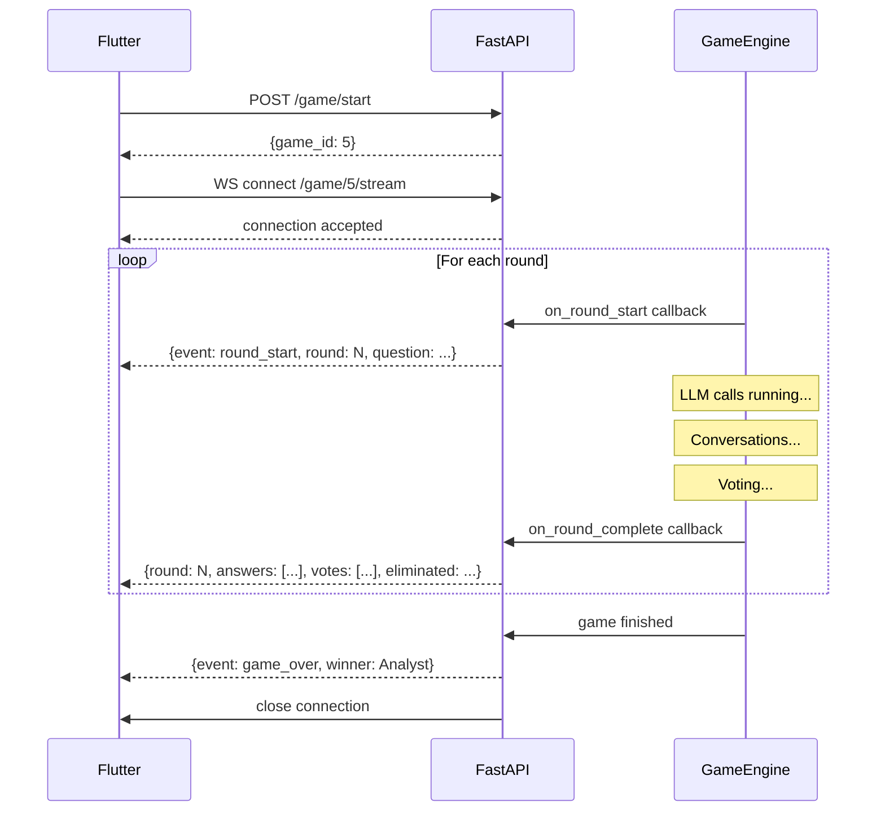
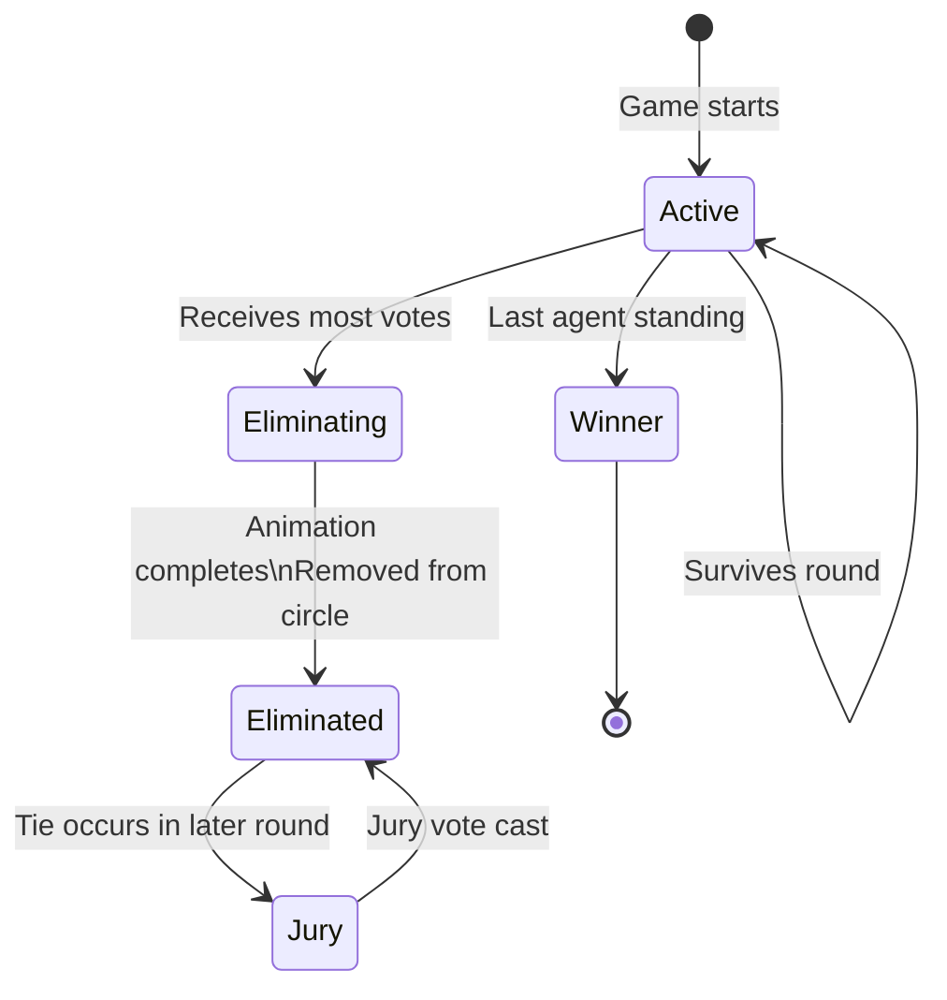

# Game Flow — AI Hunger Games

Visual breakdown of how a full game runs, how rounds work, and when special mechanics trigger.

---

## Full Game Flow

---

## Round Detail — Conversation Phase

---

## Round Detail — Voting Phase

---

## Tie Breaking — Jury Vote

---

## Memory Update — End of Each Round

---

## Memory Injection into Prompts

---

## WebSocket Event Timeline

---

## Agent State Throughout a Game

---

## Quick Reference

| Mechanic | When it triggers |
|---|---|
| Private conversations | Every round, before voting |
| Jury vote | When active agents tie on votes |
| No winner | Jury also ties, or jury unavailable (Round 1 tie) |
| Memory injection | Every round, in voting + conversation prompts |
| round_start event | Before any LLM calls begin each round |
| round_complete event | After elimination, before next round |
| game_over event | After while loop exits |